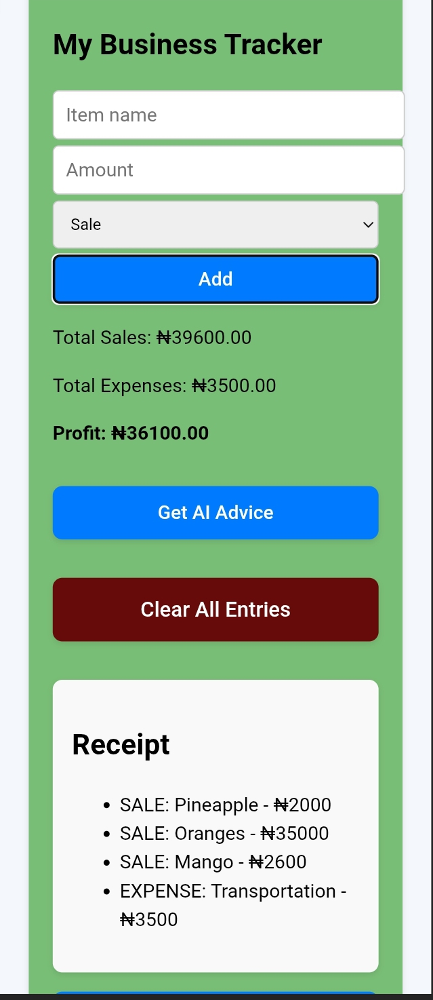

# Markdown #

# 📊 Ter Business — Smart Business Tracker App# 📊 ter business — smart business tracker app

**live demo:** [click here to use the app](https://zaayaraphael.github.io/ter-business/)

ter business is a simple yet powerful business tracking app built for small business owners, students, and entrepreneurs. it helps users manage daily sales and expenses, calculate profits, generate receipts, and even receive ai-powered business advice — all in one place.

## 🚀 features

- ✅ track daily sales and expenses  
- ✅ calculate and display profits  
- ✅ save business data in your browser (no login required)  
- ✅ generate and print receipts easily  
- ✅ get personalized ai-generated business advice  
- ✅ access helpful business tips and startup guides  
- ✅ clean and simple user interface  
- ✅ responsive design for desktop and mobile  

## 🛠️ tech stack

- **frontend:** react.js  
- **styling:** plain css  
- **ai integration:** openai api (for advice & chatbot)  
- **data storage:** browser local storage (no backend yet)

## 🌱 upcoming features

- 🔒 user authentication & login system (with firebase or supabase)  
- 📊 dynamic graphs and charts for visual insights  
- 💾 cloud storage for saving data across devices  
- 🧠 smart business health prediction & sales forecasting  
- 🧰 admin dashboard with filters and search  
- 📈 export reports in pdf/csv format

## 📸 Screenshots

### 🏠 Home Page/My Tracker

### ➕ AI start up Guide

### 🤖 Business Tips

## 💡 inspiration

this app was built as part of a software development challenge to empower small business owners with a beginner-friendly digital tool that’s both educational and practical. it’s also aligned with the developer's journey to becoming a full-stack developer and contributing real-world solutions through code.

## ⚠️ Note: The AI advice feature may be temporarily unavailable due to OpenAI API key limits. The code logic is in place, and can be reactivated with a valid key.

## 🙋‍♂️ author

*Raphael Zaaya*  
frontend developer | tech enthusiast | small business advocate  
github: [@zaayaraphael](https://github.com/zaayaraphael)

## 📬 feedback & contributions

have feedback or want to contribute? feel free to open an issue or fork the repo. your suggestions are welcome!
